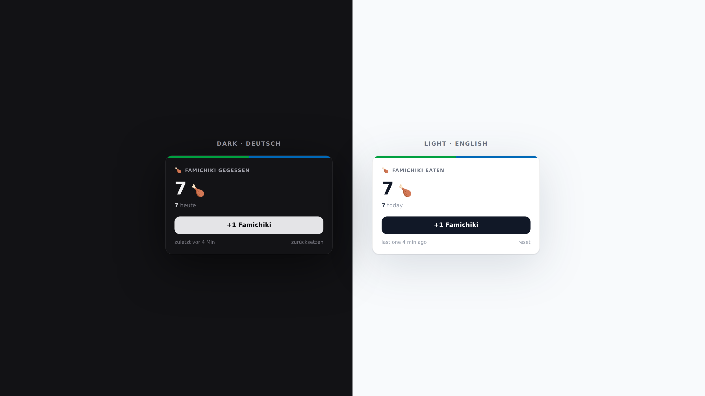

# Famichiki Counter 🍗

> A TREK dashboard widget that counts every Famichiki you eat on your trip.

## What it does

**Famichiki** (ファミチキ) is the cult fried-chicken snack sold hot at the
counter of every **FamilyMart** in Japan — crispy, boneless, and dangerously
easy to eat one-after-another while travelling. This widget turns that guilty
pleasure into a running score.

It drops a small card onto your TREK dashboard with a big tally of how many
Famichiki you've eaten, a **+1 Famichiki** button to log the next one, and a
"today" line so you can see how the day is going. Every count is kept **per
user** in the plugin's own private database, so your tally is yours alone and
survives restarts. The little chicken does a happy hop each time you log a
bite, and a two-tap **reset** lets you start a fresh trip's count without any
risk of an accidental wipe.

No accounts, no API keys, no network calls — it just remembers your Famichiki
love and shows it off. Itadakimasu!

## Screenshots

The card shows your all-time total, how many you've had today, and when the
last one went down. Tap **+1 Famichiki** to add one; the count and the little
🍗 react instantly.

The widget follows TREK's own light and dark design tokens, so it sits natively
next to your other dashboard cards, and its interface is localized — it shows in
**English** by default and switches to **German** automatically when TREK runs
in German (`de`).

## Permissions

| Permission | Why it's needed |
|---|---|
| `db:own` | Stores your Famichiki tally in the plugin's own private SQLite file — one row per snack, kept per user. Nothing is written anywhere else and no other TREK data is touched. |

## Setup

There's nothing to configure. Install and activate the plugin from
**Admin → Plugins**, and the **Famichiki** card appears on your dashboard
sidebar. Start tapping **+1 Famichiki** every time you grab one at
FamilyMart — the counter does the rest. Use the small **reset** link (tap
twice to confirm) to zero out the tally for a new trip.

## Built with

This plugin was built with [Claude Code](https://claude.com/claude-code), using
the [`trek-plugin-dev`](https://github.com/fbnlrz/trek-plugin-skill) agent skill
— an SKILL.md skill that teaches the TREK plugin model end to end: the
`trek-plugin.json` manifest, the `definePlugin` server API, the sandboxed iframe
`postMessage` bridge, and the TREK-Plugins registry publishing flow. TREK's real
light/dark design tokens were sourced from
[`mauriceboe/TREK`](https://github.com/mauriceboe/TREK) so the card matches the
host UI exactly.

## License

MIT — see [LICENSE](./LICENSE).
