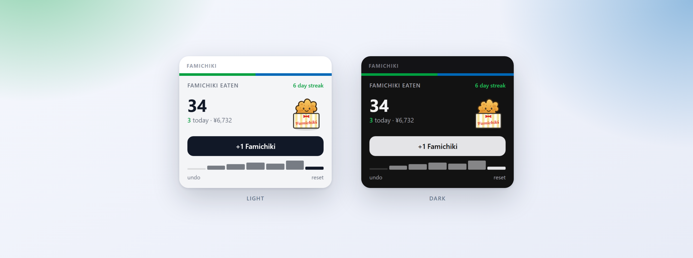

# Famichiki Counter 🍗

> A TREK dashboard widget that counts every Famichiki you eat on your trip.

## What it does

**Famichiki** (ファミチキ) is the cult fried-chicken snack sold hot at the
counter of every **FamilyMart** in Japan — crispy, boneless, and dangerously
easy to eat one-after-another while travelling. This widget turns that guilty
pleasure into a running score.

It drops a small card onto your TREK dashboard with a big tally of how many
Famichiki you've eaten, a **+1 Famichiki** button to log the next one, and a
line telling you how today is going. A seven-day bar chart shows the last week
at a glance, and once you've eaten one on two consecutive days the card starts
tracking your streak. Every count is kept **per user** in the plugin's own
private database, so your tally is yours alone and survives restarts. The little
chicken does a happy hop each time you log a bite.

Crucially, "today" means *your* day. The widget reads your time zone from TREK
and counts against your local calendar date, so a Famichiki eaten at eight in
the morning in Osaka lands on the right day instead of being filed under
yesterday, which is what a naive UTC counter would do for roughly a third of
every Japanese day.

While a trip of yours is running, each Famichiki is quietly attributed to it.
That turns the tally into something the rest of TREK can use: a badge on the
trip's dashboard card, a section in the trip's exported PDF, and — if you want
it — a line in the trip budget. Nothing leaves your server; the plugin makes no
network calls of any kind.

## Screenshots

The card shows your all-time total, how many you've had today, what they have
cost you so far, and the current streak. Tap **+1 Famichiki** to add one; the
count ticks up and the mascot gives a happy shake. Mis-tapped? **undo** takes
back the most recent one. The **reset** link clears the whole tally and asks you
to confirm first. The mascot is a hand-built inline SVG — no raster image, so it
renders crisply inside TREK's locked-down plugin sandbox.

The widget follows TREK's own light and dark design tokens, including your
chosen accent colour, so it sits natively next to your other dashboard cards.
Its interface is localized: **English** by default, switching to **German**
automatically when TREK runs in German. It is built to stay legible in a narrow
sidebar, and the layout is ordered so the button you actually came for is never
the thing that gets cut off.

## Permissions

| Permission | Why it's needed |
|---|---|
| `db:own` | Stores your Famichiki tally in the plugin's own private SQLite file — one row per snack, kept per user, plus the milestones you have already been told about. This is the source of truth for everything else below. |
| `db:read:trips` | Reads only the list of trips you can already see, to work out which one is running today so a Famichiki can be attributed to it. It never writes to a trip and never looks at places, days, files or bookings. |
| `db:write:costs` | Optional and **off by default**. When you switch on budget logging, the plugin keeps one budget item per day on the running trip — "Famichiki x3" — and updates it as the day goes on, rather than littering your budget with one row per snack. Needs the Costs addon and your own budget-edit rights. |
| `notify:send` | Sends you a TREK notification when you pass 10, 25, 50, 100, 250 or 500 Famichiki. Each milestone fires once, only ever to you, and the whole thing can be switched off in settings. |
| `hook:trip-card-provider` | Draws a small Famichiki badge on the trip's card on your dashboard. The number is the trip's total across everyone who counted on it, because TREK does not tell this hook who is looking — see the note below. |
| `hook:pdf-section-provider` | Adds a short Famichiki section, with a day-by-day table, to the trip's exported PDF. Text only; TREK lays it out. |
| `hook:user-data` | Lets TREK call the plugin when a user account is exported or deleted, so your Famichiki history goes with it. It grants no access to any TREK data — it only allows the host to reach back into this plugin's own database. |

Two things worth being straight about. The **trip card badge and the PDF section
show the trip's total, not your personal one.** TREK gives those hooks a trip,
but not the identity of the person looking, so a per-person figure is not
something the plugin can produce there — on a shared trip you are looking at the
group's combined appetite. Your own number is the one on the dashboard widget.
And only Famichiki counted **while a trip was running** carry a trip, so
anything logged between trips shows up in your personal tally but not in the
badge or the PDF.

## Setup

Install and activate the plugin from **Admin → Plugins**, and the **Famichiki**
card appears on your dashboard sidebar. Start tapping **+1 Famichiki** every
time you grab one at FamilyMart — the counter does the rest. There is nothing
you have to configure to use it.

If you want to, you can adjust it under **Settings → Plugins**. The **daily
goal** turns today's number green once you reach it. **Milestone notifications**
can be switched off. **Log to trip budget** is off until you turn it on, and
uses **price per Famichiki** and **currency** — 198 yen is roughly what
FamilyMart charged at the time of writing, so change it if your branch disagrees
or if you are counting somewhere else entirely.

### Upgrading from 1.x

This version needs **TREK 4**. Your existing tally is migrated automatically and
no counts are lost. One caveat: Famichiki counted before this version were only
ever stored with a UTC timestamp, so their local date is approximated from it.
Recent history may therefore be off by a day for entries made late in the
evening; everything counted from now on is filed against your real local day.
The new permissions mean an administrator has to approve the update once.

## Built with

This plugin was built with [Claude Code](https://claude.com/claude-code), using
the [`trek-plugin-dev`](https://github.com/fbnlrz/trek-plugin-skill) agent skill
— an SKILL.md skill that teaches the TREK plugin model end to end: the
`trek-plugin.json` manifest, the `definePlugin` server API, the sandboxed iframe
`postMessage` bridge, and the TREK-Plugins registry publishing flow. TREK's real
light/dark design tokens were sourced from
[`liketrek/TREK`](https://github.com/liketrek/TREK) so the card matches the
host UI exactly.

## License

MIT — see [LICENSE](./LICENSE).

---

 
